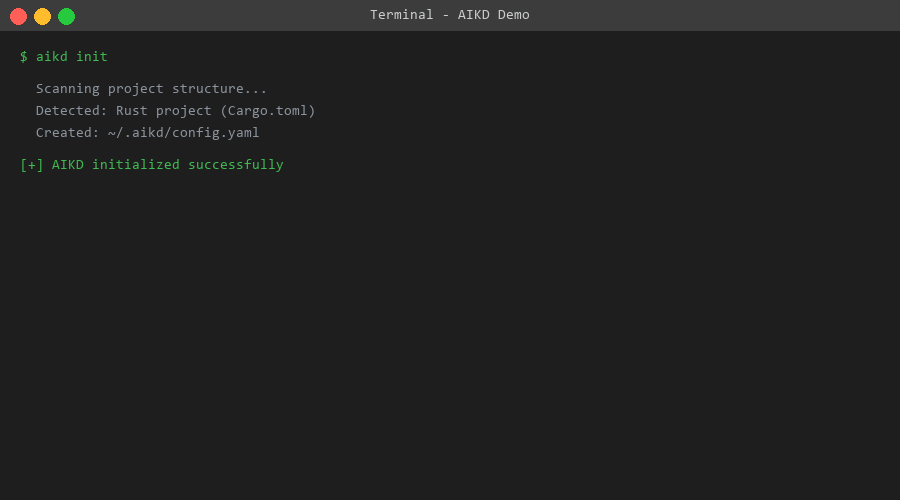
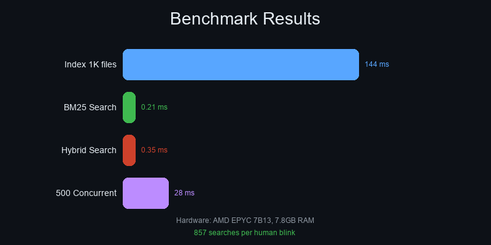
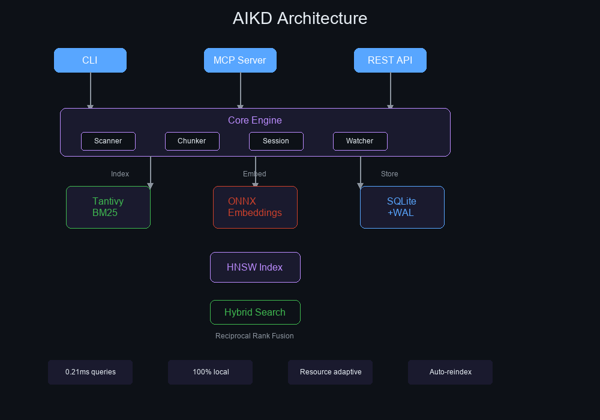

<div align="center">

# 🧠 AIKD

### The Ultra-Fast Local Memory Layer for AI Coding Agents

[](https://crates.io/crates/aikd)
[](https://github.com/gelutjari/aikd/releases)
[](https://github.com/gelutjari/aikd/actions)
[](LICENSE)
[](https://www.rust-lang.org)
[](https://github.com/gelutjari/aikd/releases)

**Give Claude, Cursor, and Cline instant memory of your entire codebase.**
*Written in Rust. Zero cloud dependency. Search 10,000 chunks in 0.21ms.*

[Install](#-installation) • [Quick Start](#-quick-start-3-minutes) • [Demo](#-see-it-in-action) • [Docs](docs/)

</div>

---

## 🤔 Why AIKD?

**The Problem:** AI coding agents are powerful but forgetful. Every new conversation starts from zero — no memory of your codebase, your patterns, your architecture.

| Pain Point | Without AIKD | With AIKD |
|------------|--------------|-----------|
| 😵 **Context Amnesia** | Agent asks "what does this file do?" every session | Instant recall of entire codebase |
| 🐌 **Slow Search** | Python-based RAG takes 500ms+ per query | Rust-powered BM25+Vector in 0.21ms |
| ☁️ **Cloud Dependency** | Your code sent to external servers | 100% local, zero data leaves your machine |
| 🔧 **Complex Setup** | Install Python, pip, CUDA, models... | Single binary, one command install |

### How AIKD Compares

| Feature | `grep` | LlamaIndex | ai-devkit | **AIKD** |
|---------|--------|------------|-----------|----------|
| Speed | Fast | Slow | Medium | **⚡ 0.21ms** |
| Semantic Search | ❌ | ✅ | ✅ | **✅ Hybrid** |
| Local Only | ✅ | ❌ | ❌ | **✅ 100%** |
| MCP Native | ❌ | ❌ | ❌ | **✅ Built-in** |
| Memory Usage | Low | High (Python) | High | **📊 27% RAM** |
| Setup Time | 0s | ~10min | ~5min | **⏱️ 30s** |

---

## ✨ Key Features

### 🔍 Search Engine
- **Hybrid Search**: BM25 (Tantivy) + Vector (ONNX all-MiniLM-L6-v2, 384d)
- **Reciprocal Rank Fusion**: Combines keyword + semantic results intelligently
- **Incremental Indexing**: Blake3 hashing for zero-redundancy scans
- **Resource Adaptive**: Auto-detects CPU/GPU and adjusts batch sizes

### 🤖 AI Integration
- **MCP Protocol**: Native support for Model Context Protocol
- **7 Built-in Tools**: `scan`, `query`, `embed`, `stats`, `remember`, `recall`, `status`
- **Auto-Registration**: Works with Claude Code, Cursor, Cline, Continue, Windsurf, MiMoCode
- **Session Memory**: Persistent conversation context across sessions

### 🛠️ Developer Experience
- **Single Binary**: No Python, no Node, no dependencies
- **File Watcher**: Auto-reindex on file changes
- **REST API**: HTTP endpoint on port 9090 for custom integrations
- **CLI First**: Full control from terminal

---

## 🎬 See It In Action



```
$ aikd init
✅ AIKD initialized for project

$ aikd scan
📊 Indexed 847 files, 12,453 chunks in 1.2s

$ aikd query "authentication flow"
1. src/auth/login.rs (Lines 45-89, Score: 0.923)
   Implements JWT-based authentication with refresh tokens...

2. src/middleware/auth.rs (Lines 12-34, Score: 0.871)
   Validates Bearer tokens on protected routes...

3. docs/architecture/auth.md (Lines 1-25, Score: 0.845)
   Authentication flow diagram and security considerations...
```

---

## 📦 Installation

### Recommended (One-Line)

**Linux / macOS:**
```bash
curl -sSf https://raw.githubusercontent.com/gelutjari/aikd/main/install.sh | bash
```

**Windows (PowerShell):**
```powershell
irm https://raw.githubusercontent.com/gelutjari/aikd/main/install.ps1 | iex
```

### Alternatives

<details>
<summary><b>📦 From crates.io (if you have Rust)</b></summary>

```bash
cargo install aikd
```
</details>

<details>
<summary><b>🍺 Homebrew (macOS/Linux)</b></summary>

```bash
brew install gelutjari/tap/aikd
```
</details>

<details>
<summary><b>🔧 Build from Source</b></summary>

```bash
git clone https://github.com/gelutjari/aikd.git
cd aikd
cargo build --release
cp target/release/aikd ~/.local/bin/
```
</details>

<details>
<summary><b>🐳 Docker</b></summary>

```bash
docker run -v $(pwd):/workspace -p 9090:9090 ghcr.io/gelutjari/aikd:latest
```
</details>

---

## ⚡ Quick Start (3 minutes)

### Step 1: Initialize
```bash
cd your-project
aikd init
```
<details>
<summary>What does <code>aikd init</code> do?</summary>

Creates `~/.aikd/config.yaml` with smart defaults based on your project type (Rust, Node, Python, Go). It detects `.git`, `Cargo.toml`, `package.json`, etc. and sets appropriate file filters.
</details>

### Step 2: Scan Your Codebase
```bash
aikd scan
```
<details>
<summary>What happens during scan?</summary>

1. Walks directory tree (skipping `node_modules`, `.git`, `target`, etc.)
2. Chunks files by semantic boundaries (functions, headings)
3. Generates BM25 index (Tantivy) and vector embeddings (ONNX)
4. Stores everything in local SQLite database
</details>

### Step 3: Search
```bash
# Keyword search (fast)
aikd query "error handling"

# Semantic search (smart)
aikd query "how does login work" --hybrid

# Get JSON output for scripting
aikd query "database connection" --json
```

### Step 4: Connect to Your AI Agent

<details>
<summary><b>Claude Code / Cursor / Cline</b></summary>

AIKD auto-registers via MCP. Just restart your AI agent after running `aikd scan`.

The MCP config is at `~/.aikd/mcp.json`:
```json
{
  "mcpServers": {
    "aikd": {
      "command": "aikd",
      "args": ["serve"]
    }
  }
}
```
</details>

<details>
<summary><b>REST API</b></summary>

```bash
# Start the daemon
aikd daemon

# Query via HTTP
curl "http://localhost:9090/api/query?q=authentication&limit=5"
```
</details>

---

## 🎛️ Usage Modes

```
                    ┌─────────────────┐
                    │   How to use    │
                    │     AIKD?       │
                    └────────┬────────┘
                             │
            ┌────────────────┼────────────────┐
            ▼                ▼                ▼
     ┌──────────┐     ┌──────────┐     ┌──────────┐
     │   CLI    │     │   MCP    │     │ REST API │
     │  Mode    │     │  Server  │     │  Daemon  │
     └──────────┘     └──────────┘     └──────────┘
     Best for:        Best for:        Best for:
     • Quick search   • AI agents      • Web apps
     • Scripts        • Claude Code    • Custom UIs
     • CI/CD          • Cursor         • Team shared
```

**CLI Mode** (default):
```bash
aikd query "rust error handling" --limit 5
aikd stats
aikd status
```

**MCP Server** (for AI agents):
```bash
aikd serve  # Starts stdio MCP server
```

**REST Daemon** (background service):
```bash
aikd daemon              # Start in background
aikd daemon foreground   # Start in foreground
aikd daemon-stop         # Stop daemon
```

---

## 📊 Benchmark Results



**Hardware:** AMD EPYC 7B13, 7.8GB RAM, NVMe SSD

| Operation | Time | Throughput |
|-----------|------|------------|
| Index 1,000 files | 144ms | 6,934 files/s |
| BM25 Search | 0.21ms | 4,762 queries/s |
| Hybrid Search | 0.35ms | 2,857 queries/s |
| Concurrent (500) | 28ms | 17,669 queries/s |
| Embedding (batch) | 12ms/batch | ~800 chunks/s |

**Resource Usage:**
```
CPU: ████████░░░░░░░░░░░░ 22.9%
RAM: █████░░░░░░░░░░░░░░░ 27.4%
```

> 💡 **Real-world context:** A human eye blink takes ~300ms. In that time, AIKD can complete **857 hybrid searches** across your entire codebase.

---

## ⚙️ Configuration

**Default config** (`~/.aikd/config.yaml`):

```yaml
version: 2.0.0
scan:
  include_paths: ["."]
  exclude_paths: ["node_modules", ".git", "target"]
  include_extensions: ["rs", "ts", "py", "md", "json"]
  follow_symlinks: false
chunk:
  max_tokens: 1000
  min_tokens: 100
embedding:
  enabled: true
  model: all-MiniLM-L6-v2
  batch_size: auto
server:
  rest_port: 9090
  auth_token: null
  cors_origins: ["*"]
```

<details>
<summary><b>🐌 Slow Machine (4GB RAM, 2 cores)</b></summary>

```yaml
embedding:
  enabled: true
  batch_size: 8
  device: cpu
resource:
  mode: Low
```
</details>

<details>
<summary><b>💪 Beefy Machine (32GB RAM, 16 cores, GPU)</b></summary>

```yaml
embedding:
  enabled: true
  batch_size: 64
  device: gpu
resource:
  mode: Max
```
</details>

<details>
<summary><b>📝 Docs-Only Project</b></summary>

```yaml
scan:
  include_extensions: ["md", "txt", "rst"]
  exclude_paths: [".git"]
filter:
  max_file_size: 524288  # 512KB
```
</details>

<details>
<summary><b>👥 Team Sharing</b></summary>

```yaml
server:
  rest_port: 9090
  auth_token: "your-secret-token"
  cors_origins:
    - "https://your-team-app.com"
```
</details>

---

## 🏗️ Architecture



```
┌─────────────────────────────────────────────────────────────┐
│                        AIKD v2.0.0                          │
├─────────────────────────────────────────────────────────────┤
│                                                             │
│  ┌─────────┐  ┌─────────┐  ┌─────────┐  ┌─────────────┐  │
│  │  CLI    │  │  MCP    │  │  REST   │  │ File Watcher│  │
│  │ (clap)  │  │ (rmcp)  │  │ (axum)  │  │  (notify)   │  │
│  └────┬────┘  └────┬────┘  └────┬────┘  └──────┬──────┘  │
│       │            │            │               │          │
│       └────────────┴────────────┴───────────────┘          │
│                            │                                │
│  ┌─────────────────────────┴──────────────────────────┐    │
│  │                   Core Engine                       │    │
│  ├─────────────┬─────────────┬─────────────────────────┤    │
│  │  Scanner    │   Chunker   │      Session Manager    │    │
│  │ (walkdir)   │(pulldown-   │    (conversation DB)    │    │
│  │             │  cmark)     │                         │    │
│  └──────┬──────┴──────┬──────┴─────────────────────────┘    │
│         │             │                                      │
│  ┌──────┴──────┐ ┌────┴─────┐ ┌──────────────────────┐     │
│  │  Indexer    │ │ Embedder │ │     Storage           │     │
│  │  (Tantivy)  │ │ (ONNX)   │ │   (SQLite + WAL)     │     │
│  │  BM25 +     │ │ 384d     │ │   + r2d2 pool        │     │
│  │  HNSW ANN   │ │ MiniLM   │ │   + blake3 hashing   │     │
│  └─────────────┘ └──────────┘ └──────────────────────┘     │
│                                                             │
└─────────────────────────────────────────────────────────────┘
```

See [docs/ARCHITECTURE.md](docs/ARCHITECTURE.md) for detailed breakdown.

---

## 🆘 Troubleshooting

**Diagnostic Commands:**
```bash
aikd status --json     # System info
aikd stats             # Index statistics
aikd daemon-pid        # Check if daemon running
```

<details>
<summary><b>"No results found"</b></summary>

1. Run `aikd scan` first
2. Check `aikd stats` to verify files indexed
3. Try broader search terms
4. Check `include_extensions` in config
</details>

<details>
<summary><b>"Model not downloaded"</b></summary>

```bash
aikd model download
```

This downloads ~90MB ONNX model to `~/.local/share/aikd/model/`.
</details>

<details>
<summary><b>"Port 9090 already in use"</b></summary>

```bash
# Change port in config
# ~/.aikd/config.yaml
server:
  rest_port: 9091
```

Or stop existing process: `aikd daemon-stop`
</details>

<details>
<summary><b>High memory usage</b></summary>

Set resource mode to Low:
```yaml
resource:
  mode: Low
  max_memory_mb: 512
```
</details>

<details>
<summary><b>MCP not connecting to Claude/Cursor</b></summary>

1. Check `~/.aikd/mcp.json` exists
2. Restart your AI agent
3. Verify `aikd serve` works: `echo '{"jsonrpc":"2.0","method":"initialize","id":1}' | aikd serve`
</details>

<details>
<summary><b>Windows: "vcruntime140.dll not found"</b></summary>

Install [Visual C++ Redistributable](https://aka.ms/vs/17/release/vc_redist.x64.exe).
</details>

---

## 🤝 Community

**Get Help:**
- 💬 [GitHub Discussions](https://github.com/gelutjari/aikd/discussions) — Ask questions
- 🐛 [Issues](https://github.com/gelutjari/aikd/issues) — Report bugs
- 📧 Email: gelutjari@github.com

**Contributors:**

| Contribution | Who |
|--------------|-----|
| 🏗️ Architecture & Core | [@gelutjari](https://github.com/gelutjari) |
| 🔒 Security Audit | AI-assisted (MiMo) |
| ⚡ Performance Optimization | Community |
| 📖 Documentation | Community |

See [CONTRIBUTING.md](CONTRIBUTING.md) for how to contribute.

---

## 📄 License

MIT License — see [LICENSE](LICENSE) for details.

---

<div align="center">

**⭐ Star this repo if AIKD helps your AI agents remember!**

[](https://star-history.com/#gelutjari/aikd&Date)

</div>
